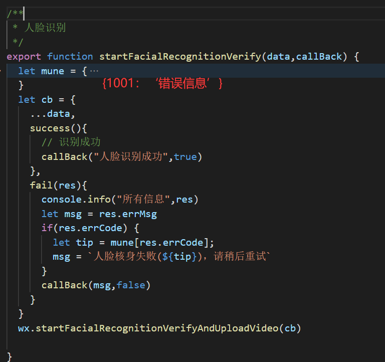

# Question & Answer

## 小程序

* 小程序为啥不能用window
  * 因为在jscode中运行的，这是一个没有窗口对象的环境

* 封装api



## 公众号

* 公众号开发时，接口没有用/api开头却可以实现代理？
  * 因为设置了电脑的host 实现了代理`C:\Windows\System32\drivers\etc\host`

## vue

* 如何实现监听对象中一个属性的变化？

```js
rule:{
    name:"",
    age:""
}

computed: {
    getName: function() {
        return this.rule.name
    }
},
watch:{
    getName:{
        handler:function(){
            //do something
        }
    }
}

```

## 路由-vue

* 如何实现路由懒加载?

```js
import Vue from 'vue';
import VueRouter from 'vue-router';
Vue.use(VueRouter);

const router = new VueRouter({
    routes: [{
        name: '',
        path: '',
        meta: {
            title: '',
            requireAuth: '',
        },
        // 使用import动态引入异步组件
        component: () => import('@/index')
    }]
})
```

* 如何实现路由嵌套？

```js
import Vue from 'vue';
import VueRouter from 'vue-router';
Vue.use(VueRouter);

const User = () => import('@/index');
const Profile = () => import('@/index/profile');
const router = new VueRouter({
    routes: [{
        name: 'user',
        path: '/user',
        component: User,
        children: [{
            // 当user/profile匹配成功时，组件会被渲染在User组件的<router-view></router-view>中
            name: 'profile',
            path: '/profile',
            component: Profile
        },{
            name: '',
            path: '',
            component: ''
        }]
    }]
})
```

* 如何实现路由拦截？
    1. 定义路由时，通过meta属性添加一个自定义字段[requireAuth]
    2. 利用全局路由钩子beforeEach()对路由进行判断
       1. 先判断该路由是否需要权限[to.meta.requireAuth]
       2. 再获取当前token是否存在
       3. 存在则next()，否则将跳转的路由path作为参数，登录成功后跳转至该路由

```js
//定义路由元信息，确定哪个路由需要登陆权限
//router>index.js
import Vue from 'vue';
import VueRouter from 'vue-router';
Vue.use(VueRouter);

const router = new VueRouter({
    routes: [{
       name:'cart',
       path:'/cart',
       component:Cart,
       meta:{ requiresAuth :true}
    }]
})

//进入路由后，确认用户是否登录
//[全局路由守卫中做判断]
//如何实现登陆后跳回原页面？
//query & this.$route
//a: 登录则放行 -- [暂时]
//b: 否则跳转至登录界面并传递目标路由地址

//app>routers>index.js -- 确认用户是否登录
router.beforeEach((to,from,next)=>{
    //判断当前路由是否需要路由权限
    if(to.meta.requiresAuth){
        //获取token
        let Authorization = localStorage.getItem('Authorization');
        if(Authorization){
            //登录则放行
            next();
        }else{
            //否则跳转到登录页面
            //同时传递路由地址 -- 为了登录后能够再次返回
            // router.push('/login');
            next({
                path:'/login',
                query:{
                    redirectUrl : to.fullPath
                }
            });
        }
    }else{
        next();
    }
})
```

* 在单个vue文件实现流程切换,并做监听回退

```js
watch: {
    '$route.fullPath': function() {
        let list = this.getQueryVariable('state')
        console.log(12121212,list,this.$route.fullPath);
        this.statusArr.map((item,index) => {
            if(index == list && this.status !== item) {
                console.log(index,list,this.status,item);
                this.handleHistory(list)
            }
        })
    }
},
methods: {
    //用于判断历史栈，是否推新的历史记录 @param n 当前的状态序号
    handleHistory(n){
        this.index=n
        this.$router.push({name: 'shenLing', query: {state: this.index}})
    },
    //跳转到下一步
    async toNext(){
        if(this.status === 'xuZhi') {
            setTimeout(() => this.handleHistory(1), 1000) ;
        } else if() {}
    }
}

```

## ajax

* 对ajax的理解？编写用ajax发生GET、POST请求
  * ajax即异步的javaScript和XML，它通过在后台与服务器进行少量数据交换，使得网页可以在不重新加载整个网页的情况下，对网页的某部分进行更新。即实现了异步更新。

```js
// 先创建网络请求
let xhr = new XMLHttpRequest();
// 设置请求对象（方法、路径、异步）
xhr.open(method, url, async);
// 发送网络请求
xhr.setRequestHeader(); // post 请求设置请求头编码格式
xhr.send(string); // 一般用get时string为空
// 监听网络请求的状态
xhr.onReadyStateChange = function() {
    if(xhr.readyState == 4) {
        if(xhr.status == 200) {
            // json -> js对象
            let data = JSON.parse(xhr.responseText);
        } else {}
    }
    let timer = setTimeout(() => {
        xhr.abort();
        clearTimeout(timer)
    },timeout)
}
```

* 如何将后台返回的文件流转为excel？并且不乱码？

```js
downloadFile() {
    this.$axios.post('/applycard-service/admin/exportExcel',
    this.formData, {
        headers: {
            Authorization: `Bearer ${this.token}`
        },
        // 请求头增加responseType，将后台返回的数据转为blob类型 [blob -- 类文件对象] -- 解决乱码
        responseType: 'blob',
    })
    .then((res) => {
        const blob = new Blob([res.data]);
        const downloadElement = document.createElement('a');
        // 创建下载的链接
        const href = window.URL.createObjectURL(blob);
        downloadElement.href = href;
        // 下载后的文件名
        downloadElement.download = `批量开卡_${this.getNowTime()}.xls`;
        document.body.appendChild(downloadElement);
        downloadElement.click(); // 下载
        // 下载完成 移除 a
        document.body.removeChild(downloadElement);
        // 释放blob对象
        window.URL.revokeObjectURL(href);
    });
},
```

## js

* 如何理解事件委托？`var currentTarget = e.target || e.srcElement;`
  * 事件委托就是利用事件冒泡的原理，将事件绑定在父级元素身上。
  * 利用事件委托，可以给尚未存在的标签绑定事件。

```js
goto(e) {
    let currentTarget = e.target || e.srcElement;
    let index = currentTarget.getAttribute("data-index");
    if(index === 'userManage' || index === 'applyManage') {
        this.$router.push({
            path: `/userCenter/${index}`
        })
        if(index === 'userManage') {
            this.userManageFlag = true;
            this.applyManageFlag = false;
            this.userMain = '用户管理';
        } else if(index === 'applyManage') {
            this.applyManageFlag = true;
            this.userManageFlag = false;
            this.userMain = '应用管理';
        }
    }
},
```

```html

```

## ES6

* let关键字
  * let声明的变量不会提升至全局作用域
  * let在同级作用域不允许重复声明
  * let会形成块级作用域
  * 暂时性死区：let/const 会使区块形成封闭的作用域。若在声明之前使用变量，就会报错。

```js
    let len = 10;
    function fn() {
        console.info(this.len)
    }
    fn();// this->window --> undefined
    let Person = {
        len: 5,
        say: function() {
            fn(); // undefined
            // arguments 是参数伪数组
            arguments[0](); // undefined
        }
    }
    Person.say(fn);
```

## ecarts

* html页面没报错，但是图形显示不出来？
  * 没有设置宽高

## canvas

```js
// 微信拍照
getPhoto(e) {
    let input = e.target
    let file = input.files[0]
    // FileReader 对象允许Web应用程序异步读取存储在用户计算机上的文件（或原始数据缓冲区）的内容，使用 File 或 Blob 对象指定要读取的文件或数据。
    //  FileReader仅用于以安全的方式从用户（远程）系统读取文件内容 它不能用于从文件系统中按路径名简单地读取文件。 要在JavaScript中按路径名读取文件，应使用标准Ajax解决方案进行服务器端文件读取，如果读取跨域，则使用CORS权限。
    let reader = new FileReader()

    // 该事件在读取操作完成时触发。
    reader.onload = (e)=> {
        // 1 为了将图像显示到画布上，需要创建一个Image()对象的实例，
          let img = new Image;
          let iheight;
          let iwidth;//图片resize宽度
          let quality = 1;//图像质量
          // 获取2d环境
          let canvas = document.createElement("canvas");
          let drawer = canvas.getContext("2d");
        if (input.getAttribute('id') == 'fromCam3' || input.getAttribute('id') == 'refromCam3' ||
            input.getAttribute('id') == 'fromCam5'|| input.getAttribute('id') == 'refromCam5') {
            iheight = 640 //1280////441
        } else {
            iheight = 720//500//300//200//960
        }
        // 2 将Image.src属性设为将要加载的图像的名字。
        img.src = e.target.result
        // 3 在显示图像之前，需要等待图像加载完毕。
        img.onload = ()=> {
            img.onload =null
            iwidth = iheight * (img.width / img.height) // 保持图片的宽高比例 进行图片的缩放
            canvas.width = iwidth
            canvas.height = iheight
            // 4 图像加载
            drawer.drawImage(img, 0, 0, iwidth, iheight)

            let finalSrc
            let degree = 90 * Math.PI / 180 // 1/4圆
            if (input.getAttribute('id') == 'fromCam1' || input.getAttribute('id') == 'fromCam2') {
                // 5 将竖放的照片旋转为横放
                if(iwidth<iheight){
                    canvas.width = iheight
                    canvas.height = iwidth
                    drawer.rotate(degree)
                    drawer.drawImage(img, 0, -iheight, iwidth, iheight)
                }
            }

            if (input.getAttribute('id') == 'fromCam3' || input.getAttribute('id') == 'refromCam3' ||
            input.getAttribute('id') == 'fromCam5'|| input.getAttribute('id') == 'refromCam5') {
                if(iwidth>iheight){
                    //将横放的照片旋转为竖放
                    iwidth = 640 //1280 //441
                    iheight = iwidth * (img.height / img.width)
                    canvas.width = iheight
                    canvas.height = iwidth
                    drawer.rotate(degree)
                    drawer.drawImage(img, 0, -iheight, iwidth, iheight)
                }
            }
            // 返回一个包含图片展示的 data URI
            // 参一：图片格式，默认为 image/png
            // 参二：在指定图片格式为 image/jpeg 或 image/webp的情况下，可以从 0 到 1 的区间内选择图片的质量。
            finalSrc = canvas.toDataURL("image/jpeg", quality)

            if (input.getAttribute('id') == 'fromCam1') {
                //身份正面
                this.imageData1 = finalSrc
                this.isActive = true
            } else if (input.getAttribute('id') == 'fromCam2') {
                //身份反面
                this.imageData2 = finalSrc
                this.isActive = true
            } else if (input.getAttribute('id') == 'fromCam3') {
                //证件照
                this.imageData3 = finalSrc
                this.handleHistory(5)
            }
            else if (input.getAttribute('id') == 'refromCam3') {
                //证件照重拍
                this.imageData3 = finalSrc
            }
            else if (input.getAttribute('id') == 'fromCam5') {
                //手持证件照
                this.imageData4 = finalSrc
                this.handleHistory(7)
            }
            else if (input.getAttribute('id') == 'refromCam5') {
                //手持证件照重拍
                this.imageData4 = finalSrc
            } else if(input.getAttribute('id') == 'fromCam6') {
                this.imageData3 = finalSrc
            }
            this.loading = false
        }
    };
    reader.readAsDataURL(file)
},
```
