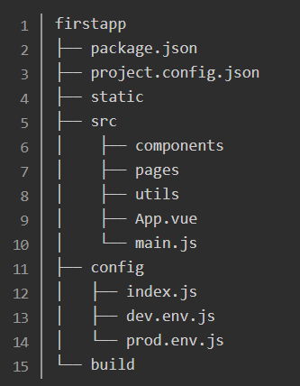
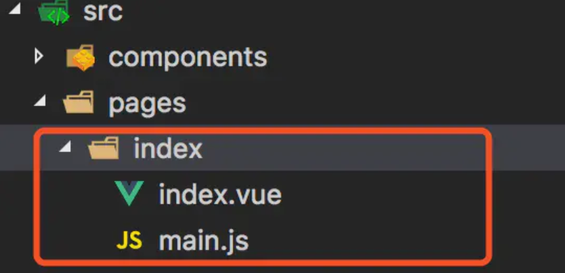

# mpvue

## 开发环境

* node.js + vue-cli + 微信开发者工具 + vsCode[Vetur插件]

## 创建小程序

* `vue init mpvue/mpvue-quickstart firstapp`
  * 从远程的代码仓库下载一份注册名为 mpvue/mpvue-quickstart 的模板代码
* `cd firstapp`
* `npm i`

### 项目的文件结构



1. package.json

    * 项目的主配置文件：mpvue项目的基本描述信息、项目所依赖的各种第三方库以及版本信息、可执行的脚本信息。

2. project.config.json

    * 用于管理微信开发者工具的小程序项目的配置文件：记录了小程序的appid、代码主目录、编译选项等信息。
    * 在微信开发者工具中导入小程序项目的时候主要通过该配置文件读取和写入配置信息。

3. static

    * 存放各种小程序本地静态资源，代码中可通过相对路径或绝对路径进行访问。

4. build

    * 用于项目编译打包的nodejs脚本和webpack配置文件

5. config

    * config目录包含了用于开发和生产环境下的不同配置，dev.env.js用于开发环境，prod.env.js用于生产环境。

   ```js
    //dev.env.js
    module.exports = merge(prodEnv, {
        NODE_ENV: '"development"',
        API_BASE_URL: '"http://127.0.0.1:8080/api"'
    })

    //prod.env.js
    module.exports = merge(prodEnv, {
        NODE_ENV: '"production"',
        API_BASE_URL: '"https://56.9.18.08:8080/api"'
    })

    //config.js
    const baseURL = process.env.API_BASE_URL
    wx.request({
        url: `${baseURL}/products`
    })
   ```

6. src

    * src目录是主要进行小程序功能编写的地方。
    1. 子目录： components、pages、utils
        * components：存放vue组件
        * pages：存放小程序页面[要遵循每个小程序页面放入一个单独子目录的组织形式]
    2. 文件：App.vue、main.js
        * main.js + App.vue：两个入口文件，相当于原生小程序框架中的app.json和app.js的复合体。

### 起项目

* src/App.vue

```js
<script>
export default {}
</script>
<style></style>
```

* src/main.js

```js
import Vue from 'vue'
import App from './App'

Vue.config.productionTip = false
App.myType = 'app' // 为了区分小程序页面组件与App.vue

const app = new Vue(App)
app.$mount()

export default {
    config: {
        pages: [],
        window: {
            backgroundTextStyle: 'light',
            navigationBarBackgroundColor: '#fff',
            navigationBarTitleText: '第一个小程序',
            navigationBarTextStyle: 'black'
        }
    }
}
```

## 程序入口

### 小程序最简单的结构：app.json + app.js + 首页

1. app.json

    * 小程序的全局配置文件：小程序的页面文件路径配置、窗口的全局样式信息、底部选项卡式菜单栏的配置，以及一些小程序网络超时的配置等等。

    * src/main.js --> 通过`export default`导出对象的cpnfig属性下的值，就是小程序的配置信息。

    ```js
    export default {
        //这部分相当于原生小程序的app.json
        config: {
            pages: [],
            window: {}
        }
    }
    ```

2. app.js

    * 包含了小程序的各种原生生命周期的方法。
    * src/App.vue --> 编写小程序的生命周期方法，也可以在其中加入小程序的全局样式

    ```js
    <script>
        /* 这部分相当于原生小程序的 app.js */
        export default {
            created () {
                console.log('miniapp created!!!')
            }
        }
    </script>
    <style>
        /* 这部分相当于原生小程序的 app.wxss */
        .container {
            background-color: #cccccc;
        }
    </style>
    ```

3. 首页 + 其他页面



* src/index/main.js --> 引入index.vue并创建vue实例

    ```js
    import Vue from 'vue'
    import App from './index'

    const app = new Vue(App)
    app.$mount()

    export default {
        config: {
            //页面级可配置属性相当于只是`src/main.js`中配置里的`window`部分
            "navigationBarTitleText": "文章列表页面"
        }
    }
    ```

* src/index/index.vue

    ```js
    <template>
        <div class="container" @click="clickHandle">
            <div class="message">{{msg}}</div>
        </div>
    </template>

    <script>
        export default {
            data () {
                return {
                    msg: 'Hello'
                }
            },
        methods: {
            clickHandle () {
                this.msg = 'Clicked!!!!!!'
            }
        }
    }
    </script>
    <style scoped>
        .message {
            color: red;
            padding: 10px;
            text-align: center;
    }
    </style>
    ```

> 模板部分我们通常可以用HTML标签来写，比如div、span等，它们会在编译的时候被自动转换成小程序的原生组件view、text之类；而那些小程序特有的组件如swiper、rich-text等，可以直接在模板中使用。
> 在原生小程序的页面（Page）中包含了很多页面的生命周期方法，如onLoad、onUnload、onShow、onHide、onPullDownRefresh等等，mpvue中推荐使用Vue组件生命周期方法，而像onPullDownRefresh、onReachBottom这类特殊功能的生命周期则需直接使用原生的。

* src/main.js指定项目首页

    ```js
    pages: [
        '^pages/index/main'
    ]
    ```

## 组件化开发

> 组件是一种抽象，允许我们使用小型、独立和通常可复用的组件构建大型应用。

### 组件的封装性

> Vue组件的写法可以避免将属于一个独立逻辑单位的代码散落在各处，可以将界面（DOM）、样式（CSS）、行为（JS）三部分的代码很好的组织在一起（推荐的实践是使用.vue文件）

* 原则：避免向外部暴露过多东西，只暴露必要的外部交互接口（组件属性、事件、方法等）
* 父子组件通讯

* src/component/click-counter.vue

```js
<template>
    <div class="click-counter">
        <div class="counter-num">次数：{{num}}</div>
        <button class="counter-btn" @click="handleClick">点我呀！</button>
        <button class="counter-reset-btn" @click="handleResetClick">清零</button>
    </div>
</template>

<script>
export default {
  // 增加一个可从外部传入的属性initNum
    props: {
        initNum: {
            type: Number,
            default: 0
        }
    },
    data() {
        return {
            num: this.initNum // 使用传入的initNum值作为初始的点击数
        };
    },

    methods: {
        handleClick() {
            this.num += 1;
        },
        handleResetClick() {
            this.num = 0;
        },
        notifyNum() {
            // 触发父组件的自定义事件 clicknum
            this.$emit("clicknum", {
                num: this.num
            });
        }
    }
};
</script>
```

* src/pages/index/index.vue

```js
<template>
  <div class="container" @click="clickHandle">
    <div class="message">{{msg}}</div>
    <!-- 使用 click-counter 组件 -->
    <!-- <click-counter /> -->
    <click-counter :init-num="10" @clicknum="handleClickNum" />
  </div>
</template>

<script>
// 导入 click-counter 组件
import ClickCounter from "@/components/click-counter";

export default {
  // 声明在当前组件下使用 counter-click 组件
  components: { ClickCounter },

  data() {
    return {
      msg: "Hello"
    };
  },

  methods: {
    clickHandle() {
      this.msg = "Clicked!!!!!!";
    },
    handleClickNum(data) {
        console.log(">>>>",data.num);
    }
  }
};
</script>
```

### 组件的复用性

### 组件的扩展性

* 组合：尽量将组件设计到最小可拆分单位，然后再将低层组件放入更高层组件中。
* 插槽：相当于在一个组件中挖出了一个或多个坑，在具体使用这些具有插槽的组件时，可以选择往坑里面填什么内容（其他组件）

* src/component/click-counter.vue

```js
<template>
  <div class="click-counter">
    <div class="counter-num">次数：{{num}}</div>
    <button class="counter-btn" @click="handleClick">点我呀！</button>
    <button class="counter-reset-btn" @click="handleResetClick">清零</button>
    <slot></slot>
  </div>
</template>
```

* src/pages/index/index.vue

```js
<template>
  <div class="container" @click="clickHandle">
    <div class="message">{{msg}}</div>
    <!-- 使用 click-counter 组件 -->
    <click-counter :init-num="10" @clicknum="handleClickNum">
      <!-- 填坑用... -->
      <input type="checkbox" /> 禁用
    </click-counter>
  </div>
</template>
```
