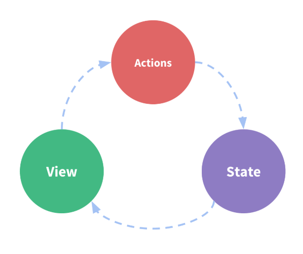
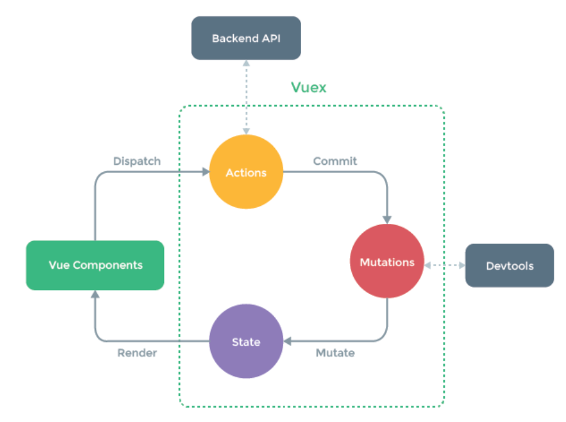

# Vuex

> Vuex 是一个专为 Vue.js 应用程序开发的状态管理模式。它采用集中式存储管理应用的所有组件的状态，并以相应的规则保证状态以一种可预测的方式发生变化。

## 状态管理模式

*1*. 单向数据流



*2*. 多组件共享时 -> 多个视图依赖于同一状态 && 来自不同视图的行为需要变更同一状态

*3*. 通过定义和隔离状态管理中的各种概念并通过强制规则维持视图和状态间的独立性 -> 管理共享状态



## 认识vuex

* 每一个 Vuex 应用的核心就是 store（仓库）。store 基本上就是一个容器，它包含着应用中大部分的状态 (state)。
* Vuex 和单纯的全局对象有以下两点不同：

    > Vuex 的状态存储是响应式的。当 Vue 组件从 store 中读取状态的时候，若 store 中的状态发生变化，那么相应的组件也会相应地得到高效更新。
    > 不能直接改变 store 中的状态。改变 store 中的状态的唯一途径就是显式地提交 (commit) mutation。这样使得我们可以方便地跟踪每一个状态的变化，从而让我们能够实现一些工具帮助我们更好地了解我们的应用。

* 创建一个store -> 提供一个初始state对象和一些mutation

```js
import Vue from 'vue'
import Vuex from 'vuex'

const store = new Vuex.Store({
    state: {
        count: 0
    },
    mutations: {
        increment (state) {
            state.count++
        }
    }
})
```

* 可以通过 store.state 来获取状态对象，以及通过 store.commit() 方法来触发状态变更

```js
store.commit('increment')
console.log(store.state.count) // -> 1
```

* 以 store 选项的方式向 vue 实例注入该 store 的机制

```js
new Vue({
    el: '#app',
    store
})
```

* eg: 从组件的方法提交一个变更
  
> 通过提交 mutation 的方式，而非直接改变 store.state.count -> 为了更加明确地追踪到状态的变化

```js
methods: {
    increment() {
        this.$store.commit('increment')
        console.log(this.$store.state.count)
    }
}
```

## state

> 通过在根实例中注册 store 选项，该store 实例会注入到根组件下的所有子组件中，且子组件能够通过 this.$store 访问到。

```js
const Counter = {
    template: `<div>{{ count }}</div>`,
    computed: {
        count() {
            return this.$store.state.count
        }
    }
}
```

### mapState 辅助函数

* 当一个组件需要获取多个状态时，将这些状态都声明为计算属性会有些复杂和冗余 -> 使用 mapState 辅助函数自动生成计算属性

```js
// 在单独构建的版本中辅助函数为 Vuex.mapState
import { mapState } from 'vuex'

export default {
    computed: mapState({
        // 箭头函数可使代码更简练
        count: state => state.count,

        // 传字符串参数 'count' 等同于 `state => state.count`
        countAlias: 'count',

        // 为了能够使用 `this` 获取局部状态，必须使用常规函数
        countPlusLocalState (state) {
            return state.count + this.localCount
        }
    })
}
```

* 当映射的计算属性的名称与 state 的子节点名称相同时 -> 可以给 mapState 传一个字符串数组

```js
computed: mapState([
    // 映射 this.count 为 store.state.count
    'count'
])
```

* mapState 函数返回一个对象。
  
### 对象展开运算符

* 通过对象展开运算符，可以将 mapState 函数返回的对象与局部计算属性混合使用

```js
computed: {
    localComputed() { /* ... */ },
    // 使用对象展开运算符将此对象混入到外部对象中
    ...mapState({
        // ...
    })
}
```

### 组件仍然保有局部状态

## Getter

> vuex允许我们在 store中定义 getter（可以认为是 store的计算属性）。就像计算属性一样，getter的返回值会根据它的依赖被缓存起来，且只有当它的依赖发生了改变才会被重新计算。
> Getter 接受 state作为其第一个参数
  
```js
const store = new Vuex.Store({
    state: {
        todos: [
            { id: 1, text: '...', done: true },
            { id: 2, text: '...', done: false }
        ]
    },
    getters: {
        doneTodos: state => {
            return state.todos.filter(todo => todo.done)
        }
    }
})
```

### 通过属性访问

* Getter 会暴露 store.getters对象，你可以以属性的形式访问
  
```js
store.getters.doneTodos // -> [{ id: 1, text: '...', done: true }]
```

* Getter 也接受其他 getter作为第二个参数
  
```js
getters: {
    doneTodosCount: (state, getters) => {
        return getters.doneTodos.length
    }
}
```

```js
store.getters.doneTodosCount // -1
```

* 可以在任何组件使用它

```js
computed: {
    doneTodosCount() {
        return this.$store.getters.doneTodosCount
    }
}
```

* getter 在通过属性访问时是作为vue的响应式系统的一部分缓存其中的

### mapGetters 辅助函数

* mapGetter 辅助函数仅仅是将 store中的 getter映射到局部计算属性

```js
import { mapGetters } from 'vuex'

export default {
    computed: {
        // 使用对象展开运算符将 getter 混入 computed 对象中
        ...mapGetters([
            'doneTodosCount',
            'anotherGetter',
        ])
    }
}
```

* 使用对象形式，给一个getter属性另取一个名字

```js
...mapGetters({
    // 把 `this.doneCount` 映射为 `this.$store.getters.doneTodosCount`
    doneCount: 'doneTodosCount'
})
```

## Mutation


